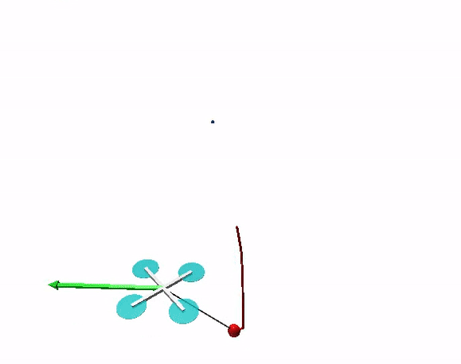
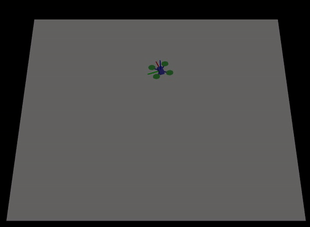

# reinmav-gym
`reinmav-gym` is a gym environment for developing mav controllers using the openai gym framework. The environment composes of two environment `native` which has a built in simulator and `mujoco` which uses the mujoco simulator to train your drone.

 

# Installation
## Requirements

- python3.6 (or 3.7) environment by one of the following 
    - system python 
    - conda 
    - virtualenv  
    - venv 
- [gym](https://github.com/openai/gym.git) 
- vpython
- [baselines](https://github.com/openai/baselines.git) **SOURCE BUILD from 90d66776a49ad5e732b935dfc891bfbd06035ed2**
- matplotlib

Note1. the code was tested on Ubuntu 16.04, 18.04 and macOS; but matplotlib has some issues in macOS. Please see [this doc](https://matplotlib.org/faq/osx_framework.html) for more details: we strongly recommend to use conda + pythonw (```conda install python.app```) on macOS.

Note2. pip package version of baselines has some issue. Please build from the source (commit code: [90d66776a49ad5e732b935dfc891bfbd06035ed2](https://github.com/openai/baselines/tree/90d66776a49ad5e732b935dfc891bfbd06035ed2))

### for mujoco env (optional)

- mujoco 1.5
- mujoco-py

1. put mjpro150 directory into ~/.mujoco
2. put mjkey.txt into ~/.mujoco
3. install apt dependencies
    - see gym README.md
4. export LD_LIBRARY_PATH
```
$ export LD_LIBRARY_PATH=$LD_LIBRARY_PATH:$HOME/.mujoco/mjpro150/bin
$ # check your nvidia driver version 
$ export LD_LIBRARY_PATH=$LD_LIBRARY_PATH:/usr/lib/nvidia-410 
```
5. install gym by pip3 install 'gym[all]'

## Install Dependencies
- Install the gym environment. The installation guidelines can be found [here](https://gym.openai.com/docs/)
```
git clone https://github.com/openai/gym
cd gym
pip install -e .
```

- [Optional] Install the baseline repository to use baseline algorithms to train the models
```
sudo apt-get update && sudo apt-get install cmake libopenmpi-dev python3-dev zlib1g-dev
git clone https://github.com/openai/baselines.git
cd baselines
pip install tensorflow-gpu # if you have a CUDA-compatible gpu and proper drivers
pip install -e .
```

## Installing the reinmav-gym package
- Clone the package and cd into it
```
git clone https://github.com/ethz-asl/reinmav-gym.git
cd reinmav-gym
```
- The environment is tested on python 3.6. Make sure you have the right python version when i
```
pip install -e .
```

## Check installation
You can check your installation using `pip show`
```
pip show gym-reinmav
Name: gym-reinmav
Version: 0.0.1
Summary: UNKNOWN
Home-page: UNKNOWN
Author: UNKNOWN
Author-email: UNKNOWN
License: UNKNOWN
Location: /Users/YOUR_INSTALLED_PATH/openai/venv/lib/python3.6/site-packages
Requires: gym
Required-by: 
```

# Using the Environment
The environment can be used as anyother gym environments. This can be done by doing the following in your script
```
import gym
...

env = gym.make('quadrotor3d-v0').unwrapped
```
'quadrotor3d-v0` is the environment ID that is registered in the gym environment. The list of environment ids in this repo can be found in `gym_reinmav/__init__.py' file.
The environment can be also be tested using the openai baselines package, for example as the following.
```
python -m gym_reinmav.run --alg=ppo2 --env=quadrotor3d-v0 --network=mlp --num_timesteps=2e7
```