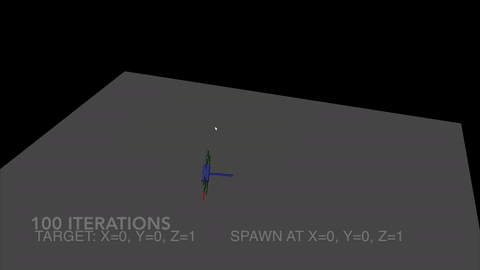

# reinmav-gym
[](https://github.com/ethz-asl/reinmav-gym/actions/workflows/build_test.yml)

`reinmav-gym` is a gym environment for developing mav controllers using the openai gym framework. The environment composes of two environments: `native` which has a built in simulator and `mujoco` which uses the mujoco simulator.
- `native` environment has a built in dynamics 2D / 3D model that does not require any additional physics engine.
- `mujoco` environment has a quadrotor model in the [mujoco](http://www.mujoco.org/) simulator for more complex environments

 

# Installation
## Requirements

- python3.6 (or 3.7) environment by one of the following 
    - system python 
    - conda 
    - virtualenv  
    - venv 
- [gym](https://github.com/openai/gym.git) 
- [vpython](https://vpython.org/)
- [baselines](https://github.com/openai/baselines.git) **SOURCE BUILD from 90d66776a49ad5e732b935dfc891bfbd06035ed2**
- matplotlib

## Notes

1. the code was tested on Ubuntu 16.04, 18.04 and macOS; but matplotlib has some issues in macOS. Please see [this doc](https://matplotlib.org/faq/osx_framework.html) for more details: we strongly recommend to use conda + pythonw (```conda install python.app```) on macOS.

2. pip package version of baselines has some issue. Please build from the source (commit code: [90d66776a49ad5e732b935dfc891bfbd06035ed2](https://github.com/openai/baselines/tree/90d66776a49ad5e732b935dfc891bfbd06035ed2))

## Install Dependencies

1. Install package dependencies
```sh
$ sudo apt update && sudo apt install libopenmpi-dev
```
2. Install gym. The installation guidelines can be found [here](https://gym.openai.com/docs/)
```sh
$ pip install gym
```
3. Install pip dependencies by 
```sh 
$ pip install -r requirements.txt
```
4. [Optional] Install mujoco, mujoco-py and gym[all]
    - See [For mujoco env (optional)](#for-mujoco-env-(optional)) for more details
5. [Optional] Install the baseline repository to use baseline algorithms to train the models
```
sudo apt-get update && sudo apt-get install cmake libopenmpi-dev python3-dev zlib1g-dev
git clone https://github.com/openai/baselines.git
cd baselines
pip install tensorflow-gpu # if you have a CUDA-compatible gpu and proper drivers
pip install -e .
```

## Installing the reinmav-gym package
1. Clone the package and cd into it
```
git clone https://github.com/ethz-asl/reinmav-gym.git
cd reinmav-gym
```
2. The environment is tested on python 3.6. Make sure you have the right python version when installing the environment
```
pip install -e .
```

## Check installation
You can check your installation using ```$ pip show```
```
pip show gym-reinmav
Name: gym-reinmav
Version: 0.0.1
Summary: UNKNOWN
Home-page: UNKNOWN
Author: UNKNOWN
Author-email: UNKNOWN
License: UNKNOWN
Location: /Users/YOUR_INSTALLED_PATH/openai/venv/lib/python3.6/site-packages
Requires: gym
Required-by: 
```
A simple geometric controller is implemented to see if the quadrotor can fly properly.
```sh
$ cd reinmav-gym/test
$ python test_quadrotor2d.py
```
or 
```sh
$ python test_quadrotor3d.py
```

## For mujoco env (optional)

### Prerequisites

- [mujoco 1.5](http://www.mujoco.org/)
- [mujoco-py](https://github.com/openai/mujoco-py)

### Steps

1. download mjpro150 from [MuJoCo website](https://www.roboti.us/index.html)
2. put mjpro150 directory into ~/.mujoco
3. put mjkey.txt into ~/.mujoco
4. install apt dependencies
    - for example on Ubuntu 16.04:
    ```sh
    $ apt-get install -y python-pyglet python3-opengl zlib1g-dev libjpeg-dev patchelf \
        cmake swig libboost-all-dev libsdl2-dev libosmesa6-dev xvfb ffmpeg
    ```
    - see gym [README - Installing everything section](https://github.com/openai/gym#installing-everything) for more details.
5. export LD_LIBRARY_PATH
```sh
$ export LD_LIBRARY_PATH=$LD_LIBRARY_PATH:$HOME/.mujoco/mjpro150/bin
$ # check your nvidia driver version 
$ export LD_LIBRARY_PATH=$LD_LIBRARY_PATH:/usr/lib/nvidia-<YOUR VERSION> 
```
6. install gym by 
```sh
$ pip3 install 'gym[all]'
```

Note. mujoco200 (MuJoCo 2.0) is not supported yet.


# Using the Environment
The environment can be used as anyother gym environments. This can be done by doing the following in your script
```
import gym
...

env = gym.make('quadrotor3d-v0').unwrapped
```
`quadrotor3d-v0` is the environment ID that is registered in the gym environment. The list of environment ids in this repo can be found in `gym_reinmav/__init__.py' file.
The environment can be also be tested using the openai baselines package, for example as the following.
```
python -m gym_reinmav.run --alg=ppo2 --env=quadrotor2d-v0 --network=mlp --play
```
For basic usages on `baslines`, refer to this [repo](https://github.com/openai/baselines)
